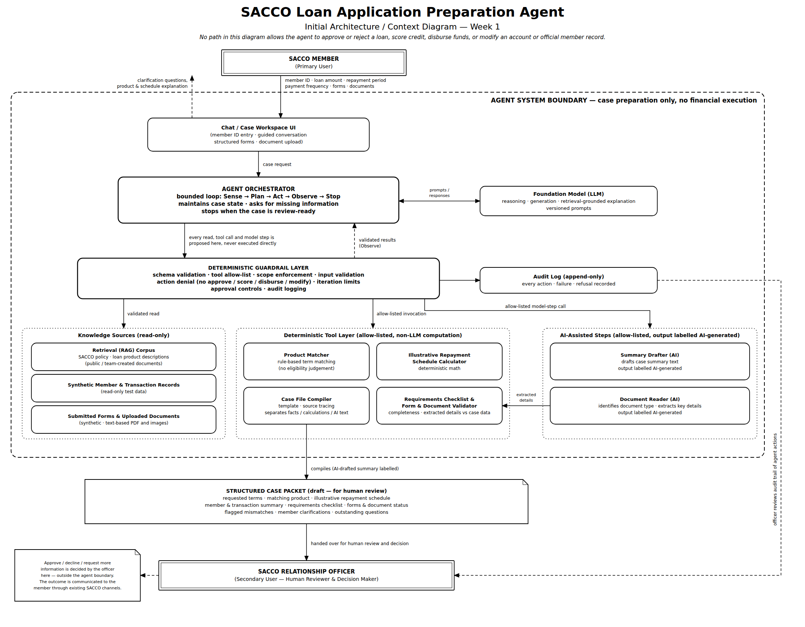

# Initial Architecture / Context Diagram — Week 1

## Description

The SACCO member (primary user) starts a case by entering a member ID in a chat/case workspace,
provides loan preferences, completes structured forms, uploads supporting documents (text-based
PDF and images) and answers clarification questions.

A bounded agent orchestrator (Sense -> Plan -> Act -> Observe -> Stop) maintains case state. It
uses a foundation model (LLM) with versioned prompts for reasoning, retrieval-grounded
explanations and clarification questions. It proposes every read, tool call and model step to a
deterministic guardrail layer, which enforces schema validation, the tool allow-list, scope
limits, denial of prohibited actions and audit logging, and returns validated results to the
orchestrator. Approved calls reach:

1. Knowledge sources (read-only): the RAG corpus, synthetic member and transaction records, and the
   case's submitted forms and documents.
2. Deterministic tools: product matcher (term matching), illustrative repayment calculator,
   requirements checklist and form/document completeness validator, and case file compiler.
3. AI-assisted steps: document reader (document type identification and detail extraction) and
   summary drafter. Their outputs are labelled AI-generated.

The agent stops when the case is review-ready and hands a draft structured case packet to the SACCO
relationship officer (secondary user), who reviews the packet and the audit trail of agent actions
and decides how the case proceeds. That decision is outside the agent boundary.

All data (member records, transactions, forms, documents) is synthetic.

No path in this diagram allows the agent to approve or reject a loan, score credit, disburse funds,
or modify an account or official member record. That boundary is enforced by the deterministic
guardrail layer and confirmed in the [AI Boundary Matrix](../requirements/ai-boundary-matrix.md).

This diagram will be extended in later weeks as the RAG pipeline (Week 3), tools (Week 4) and
agent loop (Week 5) are implemented and evidenced with execution traces (`evidence/traces/`).